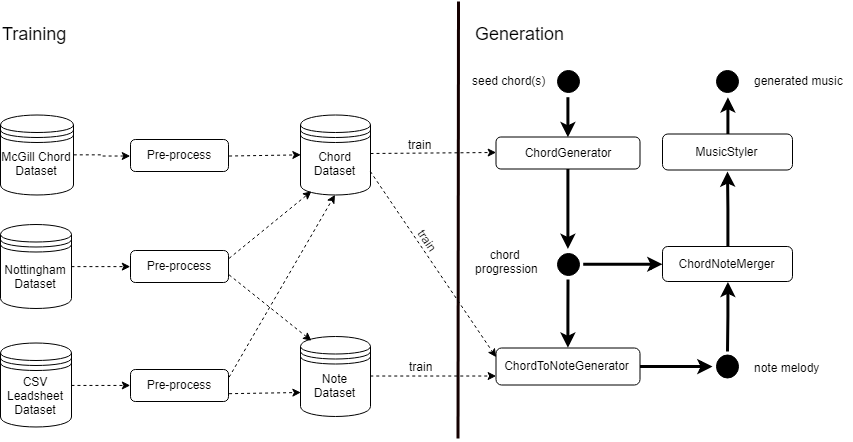

## ChordAL - A chord-based approach for AI music generation


### Introduction
It seems to be very intuitive for human composers to write songs based on chord progressions, 
especially in Western music genres like pop and jazz music. However, not much work is done on exploring
how we could generate melodies based on given chord progressions. 

Here we propose **ChordAL**, which is a chord-based learning system for music composition using deep learning.


### Architecture


The generation process is divided into 3 parts: *chord generation*, *chord-to-note generation*, and *music styling*.

We see chord-to-note generation tasks to be similar with **neural machine translation** tasks, which
requires a large amount of *parallel datasets* between chords and notes. Hence, we make use of [McGill Chord Dataset](http://ddmal.music.mcgill.ca/research/salami/annotations), 
[Nottingham dataset](https://github.com/jukedeck/nottingham-dataset) cleaned by Jukedeck, 
and [CSV leadsheet database](http://marg.snu.ac.kr/chord_generation/) published by MARG Seoul, Korea.

To the best of our knowledge, we note that such parallel datasets are still scarce to find. We would like to call for recommendations 
/ annotations of such parallel datasets for training better models in future.

### File Structure
Each folder is structured to be a component of ChordAL's system:
 - `chord`: chord generation
 - `dataset`: data-loading related functions
 - `evaluation`: automated evaluation test on chord and melody note generation
 - `generator`: song generator that combines chord and melody, with music styling
 - `models`: collection of models used / experimented in ChordAL
 - `visualizer`: a Flask web application for demonstration of ChordAL's features

### Try ChordAL yourself!
```bibtex
pip install -r requirements.txt
cd visualizer
python3 main.py
``` 
You can then try it on your browser at localhost:5000. Enjoy and hope you like it!

### References and Contribution
To be added